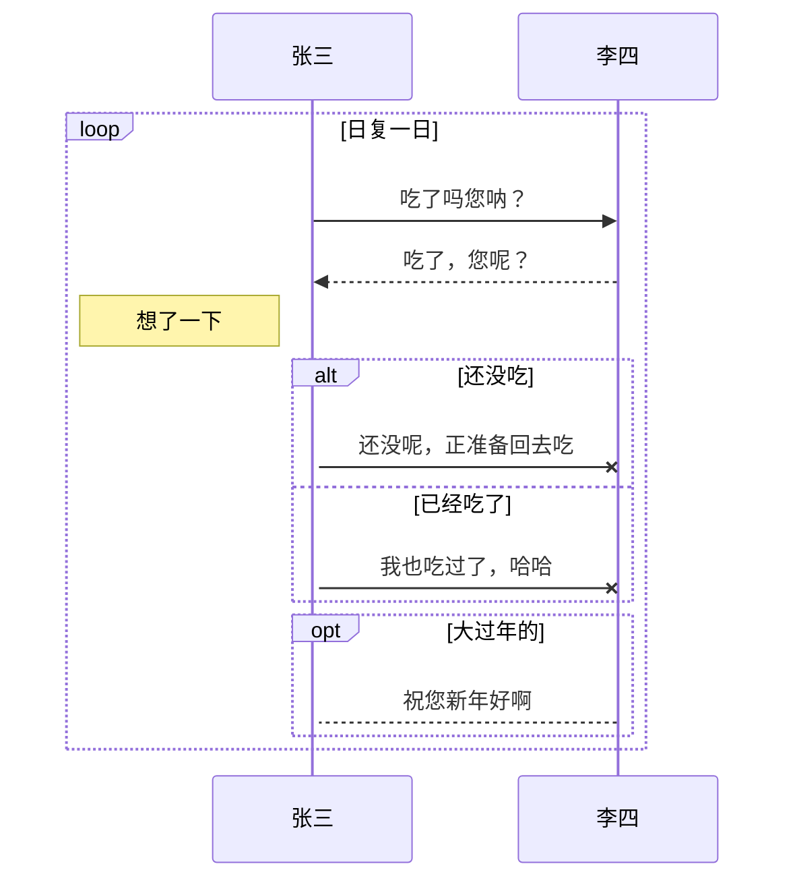
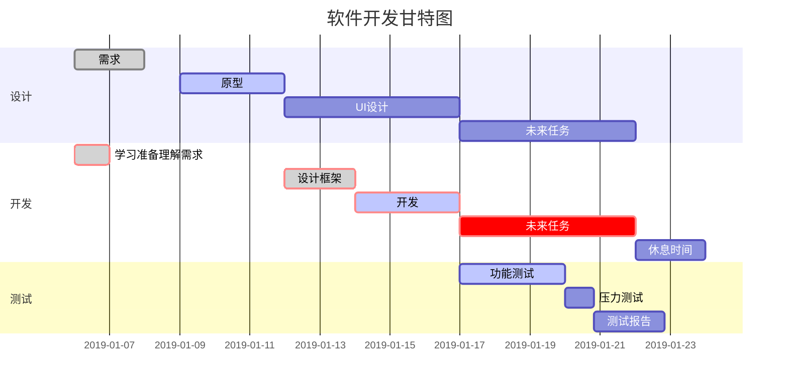

# 团队文档协作利器

## 1.工具

OSS图床

用户名：gitbook@1117434525436309.onaliyun.com

登录地址：https://signin.aliyun.com/1117434525436309.onaliyun.com/login.htm

密码:ts@teenysoft

### 1.1 Markdown

Markdown 是一种轻量级标记语言，它允许人们使用易读易写的纯文本格式编写文档。

Markdown 语言在 2004 由约翰·格鲁伯（英语：John Gruber）创建。

Markdown 编写的文档可以导出 HTML 、Word、图像、PDF、Epub 等多种格式的文档。

Markdown 编写的文档后缀为 **.md**, **.markdown**。

当前许多网站都广泛使用 Markdown 来撰写帮助文档或是用于论坛上发表消息。例如：GitHub、简书、reddit、Diaspora、Stack Exchange、OpenStreetMap 、SourceForge等。


秀一下markdown的画图功能

mermaid





### 1. 制作一份待办事宜 [Todo 列表](https://www.zybuluo.com/mdeditor?url=https://www.zybuluo.com/static/editor/md-help.markdown#13-待办事宜-todo-列表)

- [ ] 支持以 PDF 格式导出文稿
- [ ] 改进 Cmd 渲染算法，使用局部渲染技术提高渲染效率
- [x] 新增 Todo 列表功能
- [x] 修复 LaTex 公式渲染问题
- [x] 新增 LaTex 公式编号功能

### 2. 书写一个质能守恒公式[^LaTeX]

$$
h(\theta) = \sum_{j=0} ^n \theta_j x_j
$$
这是一个能量守衡行内公式$E=mc^2$

### 3. 高亮一段代码[^code]

```python
@requires_authorization
class SomeClass:
    pass

if __name__ == '__main__':
    # A comment
    print 'hello world'
```

### 4. 高效绘制 [流程图](https://www.zybuluo.com/mdeditor?url=https://www.zybuluo.com/static/editor/md-help.markdown#7-流程图)

```flow
st=>start: Start
op=>operation: Your Operation
cond=>condition: Yes or No?
e=>end

st->op->cond
cond(yes)->e
cond(no)->op
​```绘制表格
```

| 项目   |   价格 | 数量 |
| ------ | -----: | :--: |
| 计算机 | \$1600 |  5   |
| 手机   |   \$12 |  12  |
| 管线   |    \$1 | 234  |

### 1.2 Markdown编辑器：[typora](https://typora.io/)

Typora 支持 MacOS 、Windows、Linux 平台，且包含多种主题，编辑后直接渲染出效果。

支持导出HTML、PDF、Word、图片等多种类型文件。

### 1. 3、gitbook

主 **个人笔记** **团队知识库** **产品手册**

Gitbook可以用文档建立一个网站，让更多人了解你写的书，另外，最最核心的是，他支持Git，也就意味着，它是一个分布式的文档编辑工具。 你可以随时随地来编写你的文档，也可以多人共同编写文档，哪怕多人编写同一页文档，它也能记录每个人的内容，然后告诉你他们之间的区别，也能记录你的每一次改动，你可以查看每一次的书写记录和变化。

GitBook工具链是开源并且完全免费的，它的源码可以在 [GitHub](https://github.com/GitbookIO/gitbook) 上获取。

GitBook 是一个基于 Node.js 的命令行工具，支持 Markdown 和 AsciiDoc 两种语法格式，可以输出 HTML、PDF、eBook 等格式的电子书

[Gitbook文档（中文版）](chrisniael.gitbooks.io/gitbook-documentation/content/index.html) or [gitbook中文](gitbook.hushuang.me/setup.html)

# 2 如何安装GitBook

##### 要求

GitBook的安装非常简单。您的系统只需满足这两个要求：

- NodeJS（推荐使用v4.0.0及以上版本）
- Windows，Linux，Unix或Mac OS X

##### 使用NPM安装

安装GitBook的最好方法是通过 `NPM` 安装。在已经安装好NodeJS和NPM的电脑上，通过命令行窗口，输入以下命令安装GitBook：

```
$ npm install gitbook-cli -g
```

`gitbook-cli` 是安装和管理GitBook版本库的程序。它会自动安装GitBook所需的模块来创建一本书。

##### 创建一本书

GitBook通过以下命令在当前目录创建一本书：

```
$ gitbook init
```

如果你想用现有的目录来创建一本书，你可以通过运行 `gitbook init ./directory`来实现

使用下面的命令预览您创建的图书：

```
$ gitbook serve
```

或者使用以下命令构建静态网站：

```
$ gitbook build
```

##### 安装其他版本

`gitbook`命令可以方便地下载和安装不同版本的GitBook来测试你的书：

```
$ gitbook fetch 4.0.0-alpha.1
```

使用`gitbook ls-remote`列出可用于安装的远程版本。

```
$ gitbook ls-remote
Available GitBook Versions:

     4.0.0-alpha.5, ...部分省略..., 4.0.0-alpha.1, 3.2.2, 3.2.1, ...部分省略..., 2.0.0-alpha.1

Tags:

     latest : 3.2.2
     pre : 4.0.0-alpha.5
```

##### 调试

您可以使用`--log=debug`和`--debug`来获得更详细的错误消息（堆栈跟踪）。例如：

```
$ gitbook build ./ --log=debug --debug
```

or

```
$ gitbook serve ./ --log=debug --debug
```

##### 后台运行

如果你是云服务器，直接 gitbook server 运行，当退出远程窗口后，gitbook 就自动退出了，可以使用以下命令后台运行（ubuntu）

```
setsid gitbook serve 
```

##### 结束后台任务

找出gitbook 进程ID

```
ps -aux | grep gitbook
```


结束进程

```
kill 17940
```

## 3. gitbook安装和使用插件方法

在根目录下创建`book.json`

在该文件中按照指定格式插入以下插件对应的代码。


安装插件有两种方式 ：

一种是在`book.json`写入相应插件和配置后，

使用`gitbook install`安装插件。

一种是使用`npm install pluginName`安装，然后写入配置

### 3.1 `hide-element` 隐藏元素

主要用来隐藏不想看到的元素。

如：

默认的`gitbook`左侧提示：`Published with GitBook`


使用方式：
在`book.json`中写入以下内容

```
{
    "plugins": [
        "hide-element"
    ],
    "pluginsConfig": {
        "hide-element": {
            "elements": [".gitbook-link"]
        }
    }
}
```

### 3.2 `back-to-top-button` 回到顶部

当文章篇幅较长时，页面底部会显示按钮，一键点击自动回到顶部。


使用方式:

在`book.json`中写入以下内容

```
{
    "plugins": [
         "back-to-top-button"
    ]
}
```

### 3.3 `chapter-fold` 导航目录折叠

`gitbook`默认目录没有折叠效果。


使用方式：
在`book.json`中写入以下内容

```
{
    "plugins": ["chapter-fold"]
}
```

### 3.4`code` 复制代码

在代码域的右上角添加一个复制按钮，点击一键复制代码。


使用方式：

在`book.json`中写入以下内容

```
{
    "plugins" : [ "code" ]
}
```

### 3.5 `splitter` 侧边栏宽度可调节

左侧目录和右侧文章可以拖动调节宽度。


使用方式：

在`book.json`中写入以下内容

```
{
    "plugins": [
        "splitter"
    ]
}
```

### 3.6 `search-pro` 高级搜索

支持中英文，准确率更高一些。


使用方式：

在`book.json`中写入以下内容

```
{
    "plugins": [
          "-lunr", 
          "-search", 
          "search-pro"
    ]
}
```

### 3.7`insert-logo` 插入`logo`

在左侧导航栏上方插入`logo`。


使用方式：
在`book.json`中写入以下内容

`url`支持本地图片也支持网络图片链接

```
{
    "plugins": [ "insert-logo" ]
    "pluginsConfig": {
      "insert-logo": {
        "url": "images/logo.png",
        "style": "background: none; max-height: 30px; min-height: 30px"
      }
    }
}
```

### 3.8 `custom-favicon` 修改标题栏图标

设置浏览器选项卡标题栏的小图标。


使用方式：

在`book.json`中写入以下内容

注意只支持`ico`后缀的图片，并且只支持本地图片，不支持网络图片链接。

```
{
    "plugins" : ["custom-favicon"],
    "pluginsConfig" : {
        "favicon": "icon/favicon.ico"
    }
}
```

### 3.9 `pageview-count` 阅读量计数

记录每个文章页面被访问的次数。


使用方式：

在`book.json`中写入以下内容

```
{
  "plugins": [ "pageview-count"]
}
```

### 3.10`tbfed-pagefooter` 页面添加页脚

在每个文章下面标注版权信息和文章时间。


使用方式：

在`book.json`中写入以下内容

```
{
    "plugins": [
       "tbfed-pagefooter"
    ],
    "pluginsConfig": {
        "tbfed-pagefooter": {
            "copyright":"Copyright &copy dsx2016.com 2019",
            "modify_label": "该文章修订时间：",
            "modify_format": "YYYY-MM-DD HH:mm:ss"
        }
    }
}
```

### 3.11`popup` 弹出大图

点击可以在新窗口展示图片。


使用方式：

在`book.json`中写入以下内容

```
{
  "plugins": [ "popup" ]
}
```

### 3.12 `sharing-plus` 分享当前页面

```
gitbook`默认只有`Facebook、Google+、Twiter、Weibo、Instapaper
```

插件可以有更多分享方式，也可以关闭指定分享方式。


使用方式：

在`book.json`中写入以下内容

```
{
    "plugins": ["-sharing", "sharing-plus"],
    "pluginsConfig": {
        "sharing": {
             "douban": true,
             "facebook": true,
             "google": true,
             "pocket": true,
             "qq": true,
             "qzone": true,
             "twitter": true,
             "weibo": true,
          "all": [
               "douban", "facebook", "google", "instapaper", "linkedin","twitter", "weibo", 
               "messenger","qq", "qzone","viber","whatsapp"
           ]
       }
    }
}
```

### ➢ 综合代码

本文演示代码配置`book.json`

```
{
    "plugins": [
        "back-to-top-button",
        "chapter-fold",
        "code",
        "splitter",
        "-lunr",
        "-search",
        "search-pro",
        "insert-logo",
        "custom-favicon",
        "pageview-count",
        "tbfed-pagefooter",
        "popup",
        "-sharing",
        "sharing-plus"
    ],
    "pluginsConfig": {
        "insert-logo": {
            "url": "https://file.smallzhiyun.com/%E4%B9%A6.png",
            "style": "background: none; max-height: 30px; min-height: 30px"
        },
        "favicon": "./icon/book.ico",
        "tbfed-pagefooter": {
            "copyright": "Copyright &copy dsx2016.com 2019",
            "modify_label": "该文章修订时间：",
            "modify_format": "YYYY-MM-DD HH:mm:ss"
        },
        "sharing": {
            "douban": true,
            "facebook": true,
            "google": true,
            "pocket": true,
            "qq": true,
            "qzone": true,
            "twitter": true,
            "weibo": true,
            "all": [
                "douban",
                "facebook",
                "google",
                "instapaper",
                "linkedin",
                "twitter",
                "weibo",
                "messenger",
                "qq",
                "qzone",
                "viber",
                "whatsapp"
            ]
        }
    }
}
```

安装和使用


### 3.13 Gitbook添加Disqus评论功能
安装
首先在 disqus.com 中注册一个账号，登入之后在此页面注册一个Disqus页面，记住 .disqus.com 之前空白处填写的用户名

然后，在文件 book.json 的 “plugins”: [] 中加入 “disqus”

配置
在文件 book.json 中加入如下设置

"pluginsConfig": {
        "disqus": {
            "shortName": "用户名"
        }
}
用户名是之前注册 Disqus 页面时 .disqus.com 前的用户名

使用
进行正确安装和配置之后，在 GitBook 每个内容页面的最下端就可以看到 Disqus 评论区。

在 Disqus 中使用代码高亮
Disqus 的评论中如果想使用代码块高亮功能，要在代码的上下两边加 pre 和 code 的 HTML Tag 例如：

```
<pre><code class="python">
print "Hello World"
</code></pre>
```

### 3.14 edit-link在线编辑文件

`book.json`中插件名和配置信息：

```
{
    "plugins": ["edit-link"],
    "pluginsConfig": {
      "edit-link": {
            "base": "//github.com/yulilong/book/edit/master",
            "label": "编辑此页面"
       }
    }
}
```

使用`npm i gitbook-plugin-edit-link`命令安装插件。
下过如下图：


点击编辑按钮，即可跳转到github仓库在线编辑这个文件。


# 团队如何使用gitbook

## 登录权限认证

> 搭建就完成了，但是有一下内部文档，不想公布出去，怎么办，这个网上没有答案,但是方法总是有的,那就是nginx

2.1 用到nginx认证模块

```
server {


   listen 80;


   server_name www.host.com ;             # 域名注意不要加协议


   location / {


   root  html/blog;                        #根  静态文件目录


   index index.html index.htm;


   auth_basic     "pleas you password";    # nginx 认证用户和密码


   auth_basic_user_file htpasswd;          # nginx认证文件目录  可以随意指定 


}
```

2.2 因为要用到密码，而且是加密的，所有引入httpd模块

```
  $ yum -y install httpd  


  $ htpasswd -bc /applocation/nginx/conf/htpasswd qiyun 123456  #生产密码文件,如果不能写入，就创建好文件,在执行命令
```

2.3 重新检测

```
  $ nginx -t
```

2.4 重启

```
  $ nginx -S reload
```

# 如何写好一篇说明文档

## 目录

***注意：\***要想目录折叠，`SUMMARY.md`目录应该如下：

```
* [项目介绍](README.md)

* [tcp说明](doc/http/tcp/tcp说明.md)
    * [udp说明](doc/http/tcp/udp/udp说明.md)
* [html](doc/html/readme.md)
    * [HTML5-特性说明](doc/html/HTML5-特性说明.md)
```

# 参考

## [雪之梦技术驿站](https://segmentfault.com/u/snowdreams1006/articles)

[gitbook常用的插件](https://segmentfault.com/a/1190000019806829)

1. [GitBook 插件 - GitHub - zhangjikai](https://link.juejin.im/?target=https%3A%2F%2Fgithub.com%2Fzhangjikai%2Fgitbook-use%2Fblob%2Fmaster%2Fplugins.md)
2. [插件功能定制，参数详解 - GitHub - zq99299](https://link.juejin.im/?target=https%3A%2F%2Fgithub.com%2Fzq99299%2Fgitbook-plugin-anchor-navigation-ex%2Fblob%2Fmaster%2Fdoc%2Fconfig.md)
3. [Gitbook 的使用和常用插件 - 赵达](https://link.juejin.im/?target=https%3A%2F%2Fzhaoda.net%2F2015%2F11%2F09%2Fgitbook-plugins%2F)
4. [【Gitbook】实用配置及插件介绍 - zhangjk](https://link.juejin.im/?target=https%3A%2F%2Fwww.cnblogs.com%2Fzhangjk1993%2Fp%2F5066771.html)
5. [如何优雅地使用 Gitbook - 泫](https://link.juejin.im/?target=http%3A%2F%2Fblog.cugxuan.cn%2F2018%2F12%2F03%2FMarkdown%2FHow-to-use-gitbook-elegantly%2F)
6. [gitbook 入门教程之实用插件(新增3个插件) - segmentfault - 雪之梦技术驿站](https://link.juejin.im/?target=https%3A%2F%2Fsegmentfault.com%2Fa%2F1190000018777424)
7. [Gitbook模板 - GitHub - crifan](https://link.juejin.im/?target=https%3A%2F%2Fgithub.com%2Fcrifan%2Fgitbook_template)

# 

```

```